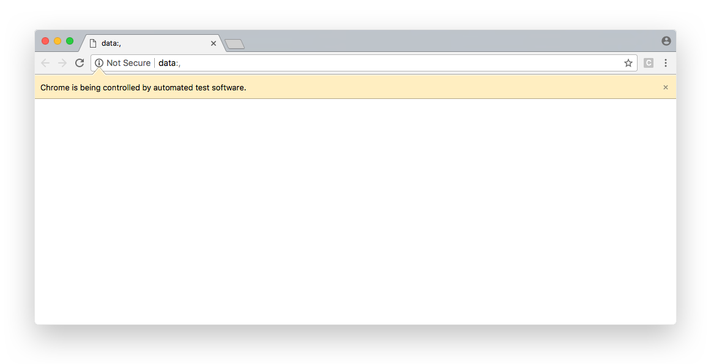
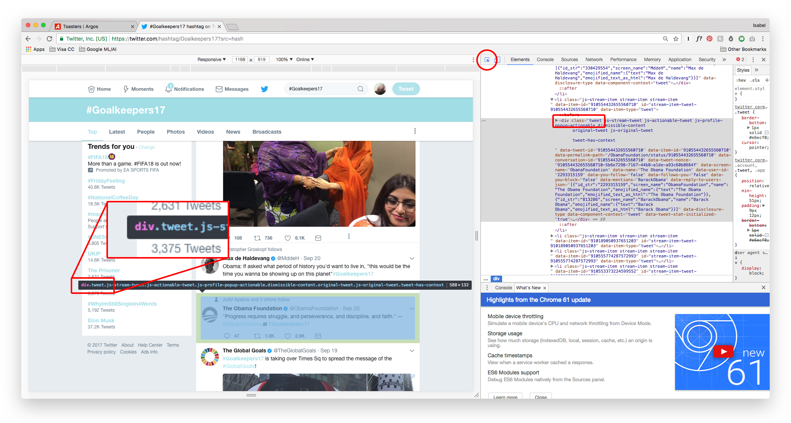

#Web scraping
There are several ways to extract information from the web. Use of APIs being probably the best way to extract data from a website. Almost all large websites like Twitter, Facebook, Google, Twitter, StackOverflow provide APIs to access their data in a more structured manner. **If you can get what you need through an API, it is almost always preferred approach over web scraping.**^[Sometimes API's have a cap on what you can scrape. For example, the Twitter API only lets you go back one week.] 

## Resources

- [Beginners guide to web scraping](https://www.analyticsvidhya.com/blog/2015/10/beginner-guide-web-scraping-beautiful-soup-python/)
    - This is a great place to start with web-scraping
    - Introduces BeautifulSoup and how to read HTML tags
- [Introduction To Web Scraping](https://www.youtube.com/watch?v=XQgXKtPSzUI)
    - Via: youtube
    - Another really useful tutorial (and also helps that it’s on youtube)
- [Twitter API](https://www.codecademy.com/en/tracks/twitter)
    - Via: Codecademy
- [How to crawl a web page with scrapy and python 3](https://www.digitalocean.com/community/tutorials/how-to-crawl-a-web-page-with-scrapy-and-python-3)
    - Via: Digital Ocean
    - Good place to start and has an example that you can follow all the way through
- [Learn Scrapy](https://learn.scrapinghub.com/scrapy/)
    - Video series for learning scrapy

## Twitter Scrape (using Beautiful SOUP)

**Libraries needed**

- [BeautifulSoup](https://www.crummy.com/software/BeautifulSoup/bs4/doc/): This well help us parse a web page
- [Selenium](http://selenium-python.readthedocs.io/installation.html#introduction): The selenium.webdriver module provides all the WebDriver implementations. Currently supported WebDriver implementations are Firefox, Chrome, IE and Remote. The Keys class provide keys in the keyboard like RETURN, F1, ALT etc.
- [Time](https://docs.python.org/2/library/time.html): Time used to pause scrolling for x number of seconds before continuing
- [csv](https://docs.python.org/2/library/csv.html): Used to write all the data we collect into a .csv file

```{python, engine.path ='/Users/isabelbeard/anaconda3/bin/python'}
from bs4 import BeautifulSoup
from selenium import webdriver
from selenium.webdriver.common.keys import Keys
import time
import csv
```

**Set up the url and filename**

Here we will create our url. In order to make the scraper more flexible, we split it up so we can use it to scrape other search results with a different hashtag. In this case we are scraping all tweets with the `#Goalkeepers17` hashtag. We also want to set up the name of the .csv file we are going to create at the end so we remember to change it as we change our scraper (don't want to save over existing files). 

`hashtag = "Goalkeepers17"` is where we can change the hashtag to retrieve a different search result

`filename = "twitterscrape.csv"` is where we name our file that we want to export our scraped data.

```{python, eval = FALSE}
#Set up google search URL
#States our webdriver as using Chrome (obviously if you don't use chrome you would need to change this)
browser = webdriver.Chrome()

#Here we broke up the url so we could insert our own hashtag to search easily
start_url = "https://twitter.com/hashtag/"
hashtag = "Goalkeepers17" #<<<<This can be changed
end_url = "?src=hash"
#combine each element of the url to create a final url
url = start_url + hashtag + end_url
#print(url) #can test the url using print

#File to write csv 
filename = "twitterscrape.csv"
```

When you run this code block you should get a pop-up of the browser that we will be controlling with selenium.




**Set up selenium**

Here we definte a function that opens our url, and scrolls down the twitter page, using `time.sleep(2)` to pause 2 seconds after every scroll to load the page. (Honestly still need to figure out what exactly is going on here). Code from [here](https://github.com/rjshanahan/twitter_scraper/blob/master/twitter_selenium_scraper.py).

```{python, eval = FALSE}
def twt_scroller(url):
    browser.get(url)
    #define initial page height for 'while' loop
    lastHeight = browser.execute_script("return document.body.scrollHeight")
    while True:
        browser.execute_script("window.scrollTo(0, document.body.scrollHeight);")
        #define how many seconds to wait while dynamic page content loads
        time.sleep(2)
        newHeight = browser.execute_script("return document.body.scrollHeight")
        if newHeight == lastHeight:
            break
        else:
            lastHeight = newHeight
    html = browser.page_source
    return html
```

**Create the soup**

We create the soup by first running the function from above on our url and then implementing the BeatifulSoup function on the full page. 

We can then inspect the HTML to pinpoint the container and class that contains all the information we need.



You can see in the image above that when you inspect the element `right click + inspect element`, you can get the container that contains all the information you will need. Here we can see that is a `div` with the `class tweet` (You can use the element selector to highlight the element which will display the html as a tool-tip and in the right-hand Elements bar. . Once we use `BeautifulSoup()` to parse our html, we use our inspected information to create a container that will find all the `div` containers with the `class tweet` in our url. 

```{python, eval = FALSE}
#create the soup
soup = BeautifulSoup(twt_scroller(url), "html.parser")

#grabs the whole tweet container
containers = soup.findAll("div", {"class":"tweet"})
```

**Grab all the information we need**

Here we have to go back and forth between the HTML and python to grab the various elements we want. In this case we wanted:

- Name
- Username
- Verified (yes/no)
- Date
- Tweet text
- `#` of replies
- `#` of retweets
- `#` of likes

We loop through all the containers we collected in the soup - and for each container we want to grab the above HTML elements (The for loop we've used at the beginning only iterates through a few elements at a time so we don't waste time if some of the elements we grab are incorrect). We can grap and element with the following code: 
```
VARIABLE = container.find("BLOCK ELEMENT", attrs={"ATTRIBUTE": "ATTRIBUTE NAME"}).get_text()
```
Fore example, to get the twitter username we can do:

```
username = container.find("span", attrs={"class": "username"}).get_text()
```
Below we've added a statement on the end of each block element to just have a blank if the there is no element there to grab. 

We also had to do a little bit of cleaning in here. For example the names were grabbed and if they were verified it was tacked on to the end of the name. We created a little statement where if the name had 'Verified account' in it, we put a one in a new category called verified (else we put a 0).Some of the text (like number of replies and retweets) also had the text 'replies' and 'retweets' so we wanted to drop that. 

We then saved all the information into a dictionary. We've printed statements at each stage just to double-check the information we get is right. 

```{python, eval = FALSE}
#checks we have a container
#print(containers[0])
#create some lists that we will populate further down
verified = []
name = []
twitter_list = []

#for container in containers[0:2] #<<<<Use this statement to just iterate through the first 3 containers so as not to waste time
for container in containers:
    fullname = container.find("span", attrs={"class":"FullNameGroup"}).get_text() if container.find('span', {'class':"FullNameGroup"}) is not None else ""
    #print("fullname:", fullname)
    if "Verified account" in fullname:
        verified = 1
        name = fullname.replace("Verified account", "")
    else:
         verified = 0   
    #print("name:", name)
    #print("verified:", verified)    
    
    username = container.find("span", attrs={"class": "username"}).get_text() if container.find("span", attrs={"class": "username"}) is not None else ""
    #print("username:", username)
    date = container.find("a", attrs = {"class": "tweet-timestamp"}).get_text() if container.find("a", attrs = {"class": "tweet-timestamp"}) is not None else ""
    #print("date:", date)
    tweet = container.find("p", attrs = {"class": "TweetTextSize"}).text.strip() if container.find("p", attrs = {"class": "TweetTextSize"}) is not None else ""
    #print("tweet:", tweet)
    replies = container.find('span',{"class":"ProfileTweet-actionCount"}).text.strip().replace(" replies .", "").replace(" reply .", "") if container.find('span',{"class":"ProfileTweet-actionCount"}) is not None else ""
    #print("replies:", replies)
    retweets = container.find('span',{"class":"ProfileTweet-action--retweet"}).text.strip().replace(" retweets", "").replace(" retweet", "") if container.find('span',{"class":"ProfileTweet-action--retweet"}) is not None else ""
    #print("retweets:", retweets)
    likes = container.find("span", {"class": "ProfileTweet-action--favorite"}).text.strip().replace(" likes", "").replace(" like", "") if container.find("span", {"class": "ProfileTweet-action--favorite"}) is not None else ""
    #print("likes:", likes)
    
    #write tweets to a dictionary
    twitter_dict = {
        "name": name.replace("\n", "").replace("\u200f\xa0", ""), 
        "verified": verified,
        "username": username,
        "date": date,
        "tweet": tweet,
        "replies": replies,
        "retweets": retweets,
        "likes": likes
    }
    
    twitter_list.append(twitter_dict)

#Test to see if everything has worked correctly
print(twitter_list[0:2])
```
Should end up with a dictionary that looks something like this:

```
[{'date': 'Sep 20',
  'likes': '260',
  'name': 'Max de Haldevang',
  'replies': '3',
  'retweets': '90',
  'tweet': 'Obama: If asked what period of history you\'d want to live in, "this would be the time you wanna be showing up on this planet"#Goalkeepers17',
  'username': '@MddeH',
  'verified': 1},
 {'date': 'Sep 20',
  'likes': '2,853',
  'name': 'The Obama Foundation',
  'replies': '47',
  'retweets': '1,018',
  'tweet': '"Progress requires struggle, and perseverance, and discipline, and faith." — @BarackObama at #Goalkeepers17',
  'username': '@ObamaFoundation',
  'verified': 1}]
```

***Define function to write a csv file**

Here we use the filename we defined earlier to write our twitter_list to a csv file. Have to specify which elemtns we want in each row. 

```{python, eval = FALSE}
#define function to write CSV file
def writer_csv(twitter_list):
    with open(filename, "w", encoding="utf8") as csvfile:
        writer = csv.writer(csvfile, lineterminator= "\n", delimiter = ",", quotechar= '"')
        for i in twitter_list:
            if len(i["tweet"]) > 0:
                newrow = i["name"], i["verified"], i["username"], i["date"], i["tweet"], i["replies"], i["retweets"], i["likes"]
                writer.writerow(newrow)
            else:
                pass
```

And then we call the function that we defined above.
```{python, eval = FALSE}
writer_csv(twitter_list)
```

Our result should be a .csv file in the folder we are working in, that has all the information we need. I've had issues opening the .csv file with microsoft excel (There are a ton of strange characters) but it seems to work smoothly when just opened with google docs instead. 